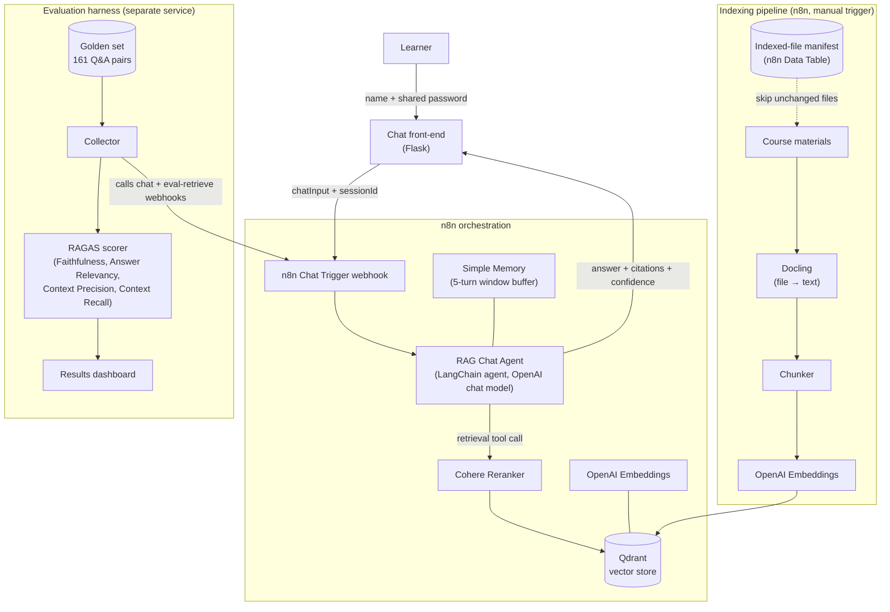

# GenAI RAG Assistant

A retrieval-augmented Q&A assistant for a live cohort-based AI course, plus
the evaluation harness used to score its answer quality against a curated
golden question set.

Built as three independent, composable pieces: a chat front-end, an n8n
orchestration/agent layer, and a RAGAS-based evaluation dashboard.

## Architecture

## Components

| Folder | What it is |
|---|---|
| `frontend/` | Password-gated Flask chat UI. Proxies messages to the n8n webhook, renders answers with citations and a confidence badge. |
| `n8n/workflow.json` | Exported n8n workflow: indexing pipeline (file → Docling → chunk → embed → Qdrant) and the RAG Chat Agent (retrieval tool + Cohere reranker + memory + chat webhook). Credential values are not included in the export — only credential names/IDs, which are meaningless outside the original n8n instance. |
| `eval/` | RAGAS evaluation harness: collects answers + retrieved contexts from n8n for a golden question set, scores them, and serves a password-gated results dashboard with trend tracking. |

## Why this stack

| Layer | Choice | Why |
|---|---|---|
| Orchestration | n8n | Visual, inspectable agent + pipeline definition; built-in LangChain nodes for agents, memory, vector stores, and rerankers without hand-rolling an agent loop. |
| Vector store | Qdrant | Fast, self-hostable, first-class n8n integration, snapshot API made cross-environment migration straightforward. |
| Reranking | Cohere Rerank | Cross-encoder reranking on top of vector similarity noticeably improves top-k precision over embedding similarity alone. |
| LLM + embeddings | OpenAI | Reliable function/tool-calling for the agent loop; `text-embedding-3-small` is a solid cost/quality default for this corpus size. |
| Document parsing | Docling | Converts heterogeneous course materials (slides, docs, PDFs) into clean text without a bespoke parser per file type. |
| Front-end | Flask | Thin, dependency-light proxy; no client framework needed for a single-page chat UI. |
| Evaluation | RAGAS | Standard, LLM-judged RAG metrics (faithfulness, answer relevancy, context precision/recall) instead of ad hoc spot-checking. |
| Hosting | Railway | One place for the database, n8n, and vector store, each with a stable public URL, without managing servers directly. |

## What's not in this repo

- The knowledge base itself (course materials fed into the indexing
  pipeline) and the 161-question golden evaluation set — both are
  proprietary course content.
- Any credentials, API keys, or the deployed app's login password.
- Eval run outputs (`eval/results/`) — regenerate them by running the
  harness against your own n8n instance and golden set.

Each subfolder's README covers running that piece independently.
